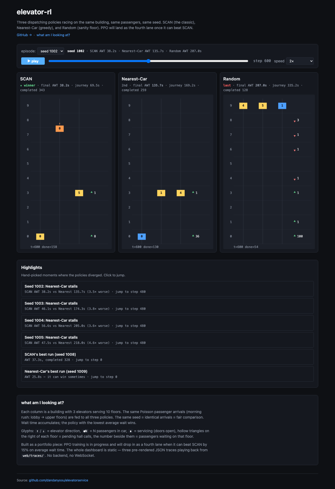

# elevator-rl

> **다중 엘리베이터 스케줄링 RL 프로젝트** — Gymnasium 환경 + 룰베이스 베이스라인
> + (예정) PPO 학습 + 추론 서버 + 대시보드

평균 대기시간(AWT), 평균 이동시간(AJT), 에너지 소비를 동시에 줄이는 강화학습
정책을 SCAN / Nearest-Car 같은 고전 알고리즘과 **동일한 시뮬레이터 위에서** 비교
합니다.

| 단계 | 산출물 | 상태 |
|---|---|---|
| **Phase 1** | Gymnasium 환경 + baseline + 단위 테스트 + 시각화 | ✅ 완료 |
| Phase 2 | PPO 학습 루프 + MLflow 로깅 | ⏳ |
| Phase 3 | FastAPI 추론 서버 + WebSocket 스트림 | ⏳ |
| Phase 4 | React 대시보드 + Docker Compose 통합 | ⏳ |

---

## 30초 데모

```bash
py -3.12 -m venv .venv
.\.venv\Scripts\Activate.ps1     # bash: source .venv/bin/activate
pip install -e ".[dev]"

pytest -q                         # 15개 테스트 통과 확인
python -m scripts.evaluate --episodes 5 --steps 600 --pattern morning
```

기대 출력 (5 episode, morning rush):

```
=== Baseline comparison (5 episodes, pattern=morning) ===
policy         AWT(s)     AJT(s)     thru/s    completed
scan          31.55±8.1     57.90      0.276       165.6
nearest       48.52±33.8    74.61      0.223       133.8
random        93.67±22.6    163.87     0.108        65.0
```

> 학습 정책의 목표는 SCAN 대비 **AWT 15% 이상 감소**. (Phase 2)

ASCII 시각화도 가능:

```bash
python -m scripts.visualize --policy scan --gif out/scan.gif --steps 200
```

마지막 ASCII 프레임 예시:

```
  step=199  t=199s  waiting=6  in_car=11  done=42
   5                  waiting=0
   4  v               waiting=1
   3                  waiting=0
   2                  waiting=0
   1                  waiting=0
   0 ^  [* 1] [^10]   waiting=5
```

읽는 법:
- `5..0` 왼쪽 숫자 = 층 (위가 고층)
- `^` `v` = hall call (상승/하강 호출 대기)
- `[* N]` = 정차해서 승하차 중 (passengers=N)
- `[^N]` `[vN]` = 운행 중 (위/아래 방향, 탑승객 N명)
- `waiting=K` = 그 층에 K명이 대기 중

---

## 시스템 아키텍처

```
┌─────────────────────────────────────────────────────────────┐
│ scripts/                                                     │
│   visualize.py  ──→  GIF / ASCII trace                       │
│   evaluate.py   ──→  baseline 비교 표                        │
└──────────────┬──────────────────────────────────────────────┘
               │
               ▼
┌─────────────────────────────────────────────────────────────┐
│ agents/baseline.py                                           │
│   ScanPolicy   — 'elevator algorithm', 한 방향으로 끝까지    │
│   NearestCarPolicy — 새 호출은 가장 가까운 엘리베이터에      │
│   RandomPolicy — sanity-check                                │
└──────────────┬──────────────────────────────────────────────┘
               │  action ∈ MultiDiscrete([3]*N)
               │  0=DOWN  1=HOLD  2=UP
               ▼
┌─────────────────────────────────────────────────────────────┐
│ envs/elevator_env.py    Gymnasium Env                       │
│   ┌──────────────────────┐  ┌───────────────────────────┐   │
│   │ envs/building.py     │  │ envs/traffic.py            │   │
│   │  엘리베이터 상태/     │  │  Poisson 도착 + OD 행렬    │   │
│   │  서비스 / 승하차      │  │  uniform/morning/lunch/    │   │
│   │  / hall-call          │  │  evening 패턴              │   │
│   └──────────────────────┘  └───────────────────────────┘   │
│           configs ← envs/config.py (dataclass, Hydra-ready) │
└─────────────────────────────────────────────────────────────┘
```

각 모듈을 단독으로 import 해서 테스트할 수 있도록 의도적으로 분리했습니다.

---

## MDP 한 눈에 (자세한 정의는 [`docs/mdp.md`](docs/mdp.md))

| 요소 | 정의 |
|---|---|
| **State** | `Box(-1, 1, shape=(N(F+3) + 2F + 1,))` — 엘리베이터별 (one-hot 층, 방향, 부하율, 서비스 플래그) + hall-call up/down + 시간 진행률 |
| **Action** | `MultiDiscrete([3]*N)` — 엘리베이터별 {`0=DOWN`, `1=HOLD`, `2=UP`} |
| **Reward** | `r = -α·wait - β·in_car - γ·energy - δ·dir_change + ε·arrivals` |
| **Episode** | 기본 3600 step (1시간), `truncated`로 종료 |
| **Reproducibility** | `reset(seed=k)` 가 traffic generator까지 시드 전파 → 동일 seed = 동일 trajectory |

기본 reward 가중치 (모두 `RewardWeights` dataclass로 조정 가능):

| 기호 | 의미 | 기본값 |
|---|---|---|
| α | 대기 페널티 (per-passenger·sec) | 0.01 |
| β | 차내 페널티 (per-passenger·sec) | 0.005 |
| γ | 운행 거리 페널티 (per floor moved) | 0.001 |
| δ | 방향 전환 페널티 (per reversal) | 0.1 |
| ε | 도착 보상 (per arrival) | 1.0 |

---

## 베이스라인 알고리즘

| 정책 | 한 줄 설명 |
|---|---|
| **SCAN** ('elevator algorithm') | 한 방향으로 끝까지 가면서 같은 방향 호출만 처리, 끝에 도달하면 반대 방향으로 reverse |
| **Nearest-Car** | 새 hall call이 발생하면 가장 가까운 정지/유휴 엘리베이터에 할당 |
| **Random** | 매 step 무작위 — sanity-check / floor for RL |

세 정책 모두 같은 `MultiDiscrete([3]*N)` action space를 출력하므로, RL 정책과 1:1로 비교 가능합니다.

---

## 디렉토리

```
elevator-rl/
├── envs/
│   ├── __init__.py        # gym.register("ElevatorRL-v0")
│   ├── config.py          # dataclass 설정 (Hydra-friendly)
│   ├── traffic.py         # Poisson + OD 행렬 트래픽 생성기
│   ├── building.py        # 엘리베이터 동역학 (정차/서비스/승하차)
│   └── elevator_env.py    # Gymnasium Env wrapper
├── agents/
│   ├── __init__.py
│   └── baseline.py        # SCAN, Nearest-Car, Random
├── scripts/
│   ├── visualize.py       # 시뮬 실행 + ASCII / GIF
│   └── evaluate.py        # baseline 비교 표
├── tests/
│   ├── test_env.py        # 결정론성 / 보상 부호 / 액션 경계
│   └── test_traffic.py    # OD 행렬 / 패턴별 분포
├── docs/
│   └── mdp.md             # MDP 정식 정의
├── pyproject.toml
├── .gitignore
└── README.md
```

---

## 트래픽 패턴

`TrafficConfig.pattern` 으로 선택:

| 패턴 | 시간대 | OD 특성 |
|---|---|---|
| `uniform` | 평시 | 모든 (origin, dest) 동일 가중치 |
| `morning` | 출근 | 로비(0층) → 상위층 6배 가중 |
| `lunch` | 점심 | 로비 / 중간층 source/sink 4배 가중 |
| `evening` | 퇴근 | 상위층 → 로비 6배 가중 |

도착은 step별 Poisson(λ)로, 1분당 평균 `base_rate_per_minute` 명. 기본 8 ppm은
1시간 약 480명 부하.

---

## 개발 팁

- 새 패턴/보상 가중치/건물 설정은 `envs/config.py`에서 dataclass 필드만 추가
- `envs/__init__.py`에서 `register()` 해 두었으므로 `gym.make("ElevatorRL-v0")`로도 사용 가능
- baseline은 `Building`을 직접 들여다봅니다 (rule-based이므로 OK). 학습 정책은
  `obs` 벡터만 받습니다
- `pytest -q` 가 통과해야 PR 가능 — `mypy --strict`, `ruff check .` 도 권장

---

## 시각 대시보드 (Phase 4 v0 — Replay + Scrub)

세 정책(SCAN / Nearest-Car / Random)이 **같은 건물, 같은 승객, 같은 시드**에서
동시에 돌아가는 모습을 보여주는 정적 웹 페이지. PPO 학습이 SCAN을 이기면
네 번째 lane으로 들어옵니다.



### 로컬에서 띄우기

```bash
# 1) trace 생성 (한 번만)
python -m scripts.emit_traces --out web/traces --seeds 10 --steps 1200 --pattern morning

# 2) 정적 서버
python -m http.server --directory web 8765
# 브라우저에서 http://localhost:8765
```

키 단축키: `Space` = play/pause, `←/→` = -30/+30 step, scrub bar로 점프.

### 구조

```
web/
├── index.html       # 페이지 구조 + about 섹션
├── style.css        # 다크 테마, 3-col 그리드, 모바일 1-col
├── app.js           # Canvas 렌더러 + 동기 playback clock + scrub
└── traces/
    ├── manifest.json
    └── {policy}-seed{NNNN}.json   # ~30개
```

### 배포 (Cloudflare Pages)

`web/`을 그대로 정적으로 서빙하면 됩니다.

```bash
# 첫 배포 (Cloudflare 계정에서 1번)
# 1. Cloudflare Pages → Create project → Connect Git → 이 repo 선택
# 2. Build command: (비워둠)
# 3. Build output directory: web
# 4. Save and Deploy
```

trace는 사람이 직접 생성해서 커밋합니다 (CI가 매번 돌리면 demo 일관성이
흔들리므로 의도적인 결정 — 자세한 건 design doc 참조).

---

## 다음 단계

- [x] 시각 대시보드 v0 (정적 replay + scrub) — `web/`
- [ ] `training/train.py` — PPO + MLflow 로깅
- [ ] PPO vs SCAN 동일 시드 100 episode 비교 (AWT 15%↓ 검증)
- [ ] PPO를 네 번째 trace로 대시보드에 추가
- [ ] action mask 옵션 (서비스 중 step에서)
- [ ] 5초짜리 README GIF (Playwright + ffmpeg)
- [ ] highlight 자동 검출 (`AWT 2x 이상 차이` 규칙)
- [ ] Ray RLlib 마이그레이션 (멀티 에이전트 실험)

> design doc: `~/.gstack/projects/dandanyoou-elevatorservice/...-design-*.md`

---

## 라이선스

MIT.
